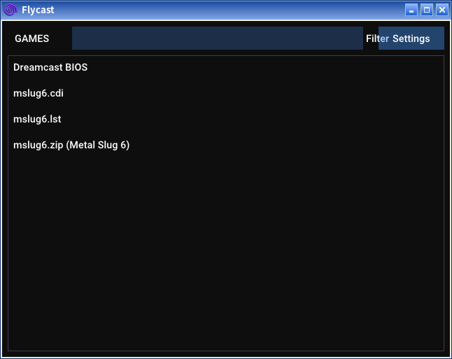
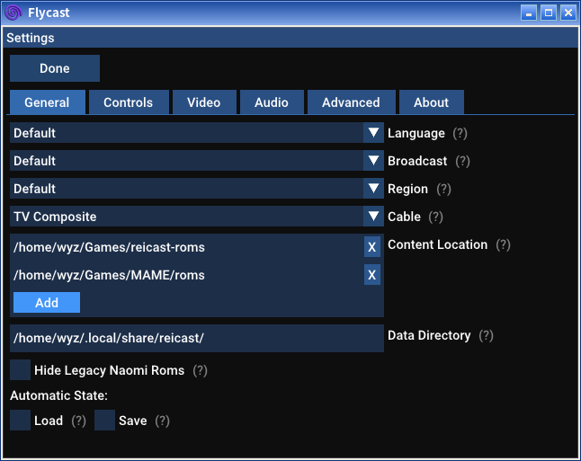
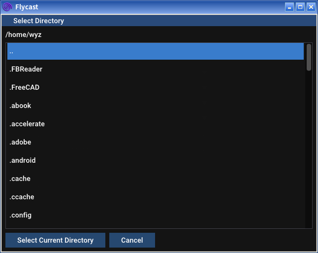
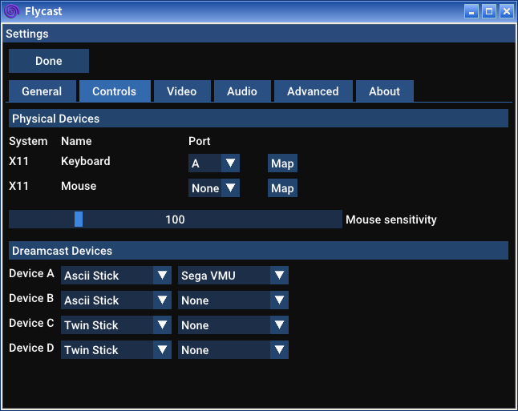
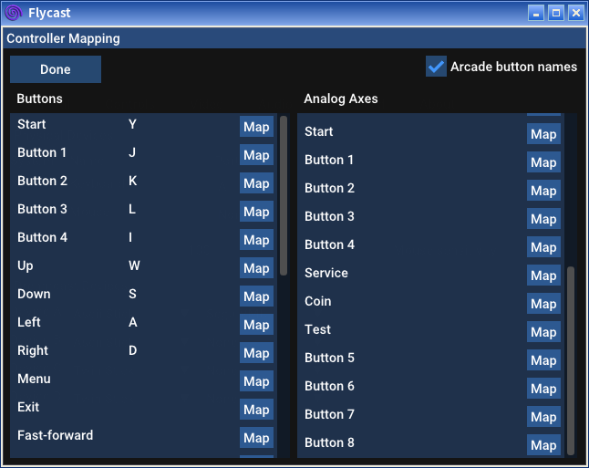

# 配置与使用说明

[**Flycast**](https://github.com/flyinghead/flycast)模拟器能稳定地运行街机版6代。不过，在不外接控制器的情况下只能一人使用。

Flycast的可设置项与使用者电脑的实际情况相关，故没法给各位一套“预设”，只能“现配现用”。为说明如何进行基本设置，写下此说明。

## 1.目录设置

如图，Flycast的界面极为简单。点击“`Settings`”按钮进入设置。

或许在你的电脑里，“`Data Directory`”一栏里的内容与截图的里很不一样，不必担心，保持默认即可。

点击中部的“`Add`”按钮，指向并设定Roms文件所在目录。

点击目录名前往所点目录，“`..`”为返回上一目录。最后点击“`Select Current Directory`”按钮设定目录。设置正确的例子可以参考上一张截图。

## 2.键位设置

在这个界面中，设置“`Physical Devices`”部分即可。

仍然，或许在你的电脑上显示出来的内容和图中有较大出入，不必担心。

*`Windows`用户最好不要设定“`Mouse`”一项，有可能导致Flycast不能用鼠标操作。*

设定“`Keyboard`”。点击这一行最后的“`Map`”按钮。

请先勾上右上角的“`Arcade button names`”复选框。

只设定左边“`Button`”一栏。

要设定的键有：`Menu`、`Button 1-5`、`上下左右`、`Start`、`Coin`、`Service`、`Test`。剩下的就随各位喜好了~

点击对应的“`Map`”按钮，按下想设定的键，就完成设定了。各键设定完成后按“`Done`”键保存并退出。

## 3.进入游戏

若设定正确，`主界面`里就会显示“`mslug6.zip (Metal Slug 6)`”一项。

点击该项即可进入游戏~

<!--
——[wyz\_2015](https://github.com/wyz-2015)
 
2021.6.20
-->

——<a href="https://github.com/wyz-2015">wyz_2015</a>

2021.6.21

